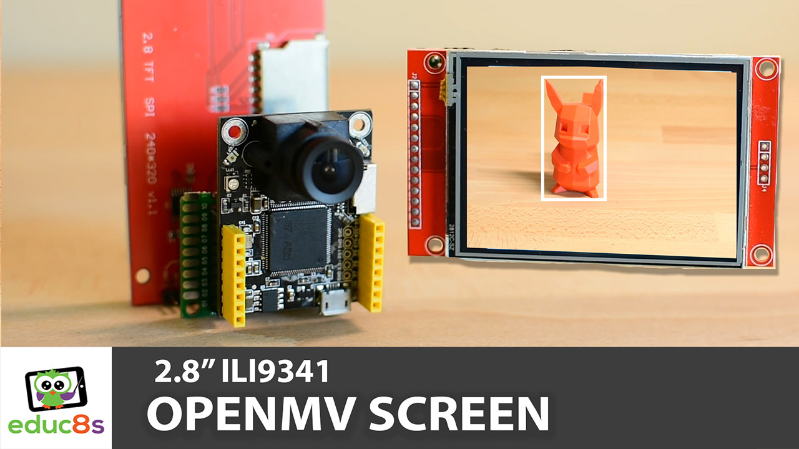

# OpenMV-ILI9341-Track-Object

This is a slight modification of the OpenMV example that comes with board.

  

🎥 <a href="https://www.youtube.com/watch?v=A1ZeEZCyMKg">Video Tutorial on YouTube</a>

 
 

| 📺 <a href="https://www.youtube.com/educ8s">YouTube</a>
| 🌍 <a href="http://www.educ8s.tv">Website</a> |  

# Parts Needed

🛒 OpenMV M7 ▶ http://educ8s.tv/part/OpenMV

🛒 OpenMV H7 ▶ http://educ8s.tv/part/OpenMVH7  💡 FASTER

🛒 ILI9341 Display ▶ http://educ8s.tv/part/28ILI9341

🛒 Prototyping Board ▶ http://educ8s.tv/part/PrototypingBoards

🛒 Soldering Iron ▶ http://educ8s.tv/part/TS100

💖 Full disclosure: All of the links above are affiliate links. I get a small percentage of each sale they generate. Thank you for your support!

# Library for the display

💻 https://github.com/OutOfTheBots/OpenMV_TFT

# Credits & Thanks

  - Kudos to [OutOfTheBots](https://github.com/OutOfTheBots) for being the creator of ILI9341 MicroPython library without which this project would not exist.

